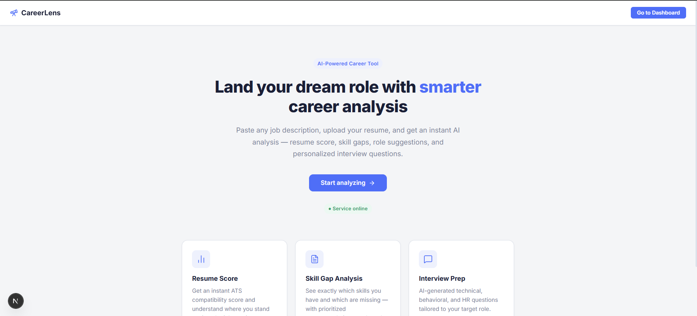
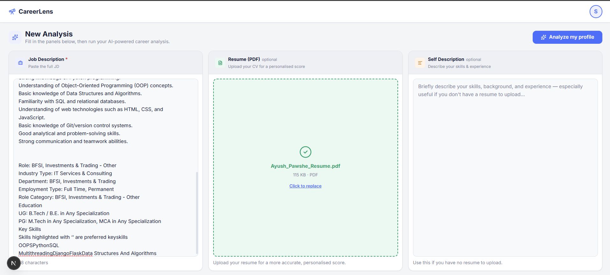
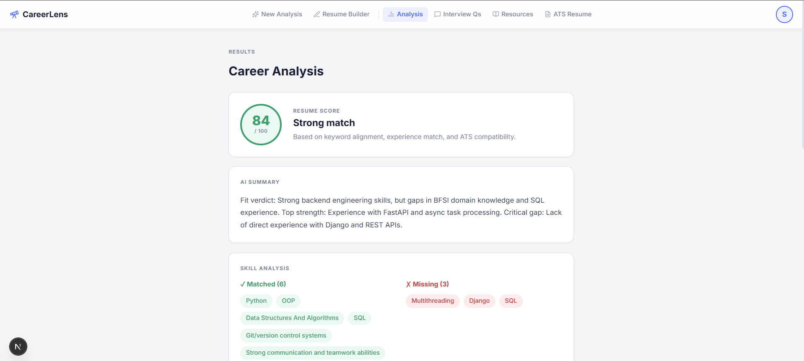
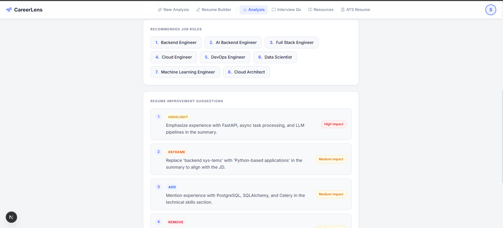
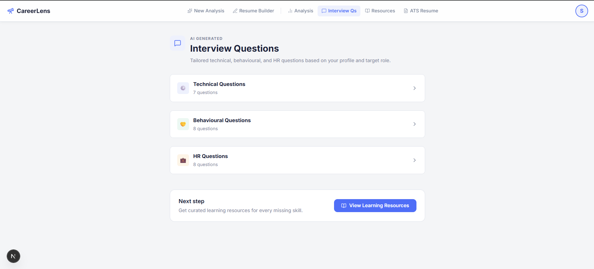
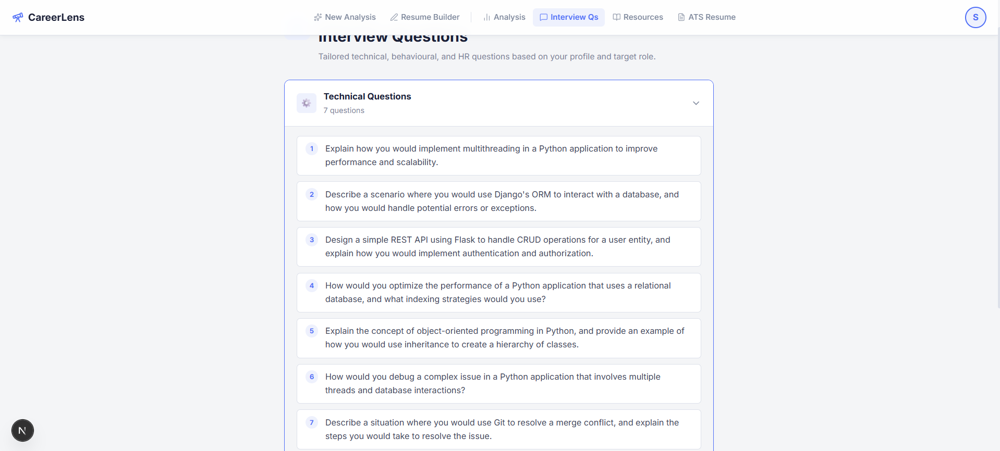
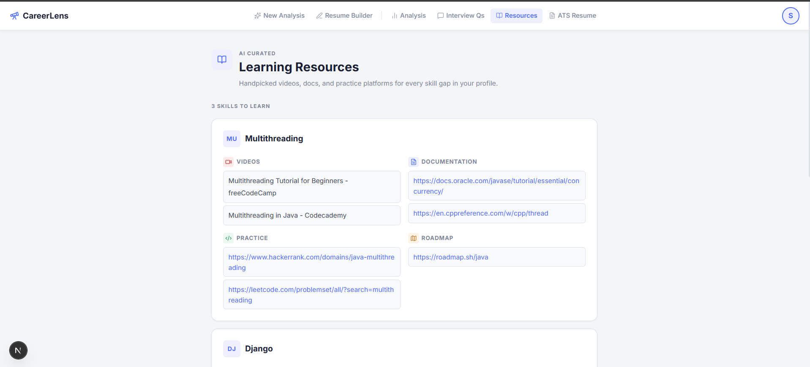
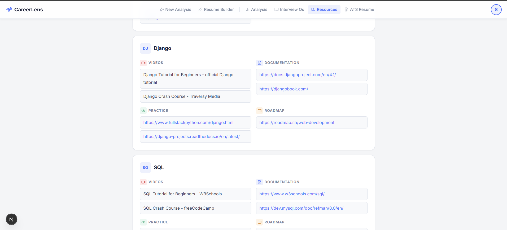
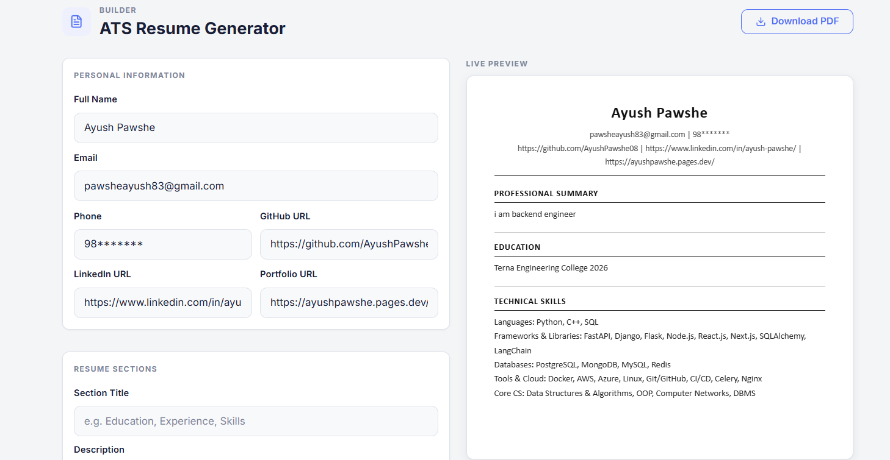
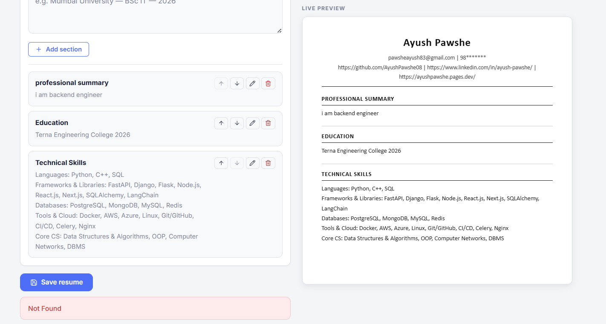

# 🔭 CareerLens — AI-Powered Career Analysis & ATS Platform

[](https://fastapi.tiangolo.com/)
[](https://nextjs.org/)
[](https://react.dev/)
[](https://tailwindcss.com/)
[](https://docs.celeryq.dev/)
[](https://redis.io/)
[](https://www.docker.com/)

> **Land your dream role with smarter career analysis.** Paste any job description, upload your resume, and get an instant AI evaluation — resume match score, missing skills breakdown, actionable suggestions, role recommendations, personalized interview prep, and a real-time ATS resume builder.

---

## 📌 Table of Contents

- [What is CareerLens?](#-what-is-careerlens)
- [Why It Matters](#-why-it-matters)
- [Key Features & UI Walkthrough](#-key-features--ui-walkthrough)
  - [1. Modern Landing Experience](#1-modern-landing-experience)
  - [2. Multi-Modal Profile & JD Analysis](#2-multi-modal-profile--jd-analysis)
  - [3. In-Depth Career & ATS Compatibility Score](#3-in-depth-career--ats-compatibility-score)
  - [4. Actionable Improvements & Job Role Recommendations](#4-actionable-improvements--job-role-recommendations)
  - [5. Role-Tailored Interview Question Generation](#5-role-tailored-interview-question-generation)
  - [6. AI-Curated Learning Roadmaps & Resources](#6-ai-curated-learning-roadmaps--resources)
  - [7. Interactive Live ATS Resume Builder](#7-interactive-live-ats-resume-builder)
- [System Architecture](#-system-architecture)
- [Tech Stack](#-tech-stack)
- [Getting Started](#-getting-started)
  - [Prerequisites](#prerequisites)
  - [1. Clone Repository](#1-clone-repository)
  - [2. Backend Setup](#2-backend-setup)
  - [3. Start Redis & Celery](#3-start-redis--celery-docker-recommended)
  - [4. Frontend Setup](#4-frontend-setup)
- [API Endpoints Overview](#-api-endpoints-overview)
- [Environment Variables](#-environment-variables)
- [Author & Connect](#-author--connect)

---

## 💡 What is CareerLens?

**CareerLens** is a full-stack, AI-native career intelligence and resume optimization platform designed for modern tech professionals and job applicants. 

Rather than sending resumes blindly into corporate Applicant Tracking Systems (ATS), CareerLens provides deep, real-time diagnostic insights comparing your CV against specific target Job Descriptions (JDs). It highlights exact keyword matches, flags missing technical proficiencies, generates customized interview preparation material, recommends vetted study resources, and lets you craft ATS-compliant resumes with instant PDF export.

---

## 🎯 Why It Matters

| The Job Seeker's Problem | How CareerLens Solves It |
|---|---|
| **Black-box ATS screening:** Up to 75% of resumes are filtered out before reaching a human recruiter due to missing keywords and bad formatting. | **Algorithmic ATS Scoring:** Inspects your resume against exact JD parameters with match percentages and highlighted skill pills. |
| **Generic interview prep:** Candidates waste hours browsing generic LeetCode problems or common questions irrelevant to the specific role. | **Targeted Q&A Generation:** AI generates Technical, Behavioral, and HR questions mapped directly to your detected skill gaps. |
| **Unclear next steps:** Knowing you lack a skill doesn't tell you how to quickly bridge that gap. | **Curated Learning Hub:** Directly links tutorials, official docs, practice problems, and roadmap.sh paths for each missing skill. |
| **Cluttered resume formatting:** Fancy multi-column layouts frequently break automated resume parsers. | **Standardized ATS Resume Builder:** Live single-column builder ensuring 100% parseability by any corporate ATS. |

---

## 📸 Key Features & UI Walkthrough

### 1. Modern Landing Experience
A sleek, accessible interface built with Next.js 16 and Tailwind CSS v4, highlighting core capabilities and fast entry into analysis workflows.



---

### 2. Multi-Modal Profile & JD Analysis
Flexible input options: paste any target job description, upload your existing PDF resume (with instant text extraction), or supply an optional self-description to evaluate candidate profiles even without a CV file.



---

### 3. In-Depth Career & ATS Compatibility Score
Instant evaluation calculating a weighted ATS compatibility score (e.g. `84/100 Strong Match`), an AI-written executive summary of candidate strengths/critical gaps, and categorized **Matched** vs. **Missing** skill pills.



---

### 4. Actionable Improvements & Job Role Recommendations
Clear, ranked alternative career paths tailored to your background, accompanied by prioritized resume editing directives (`HIGHLIGHT`, `REFRAME`, `ADD`, `REMOVE`) with impact ratings.



---

### 5. Role-Tailored Interview Question Generation
Generates dedicated question pools categorized into **Technical**, **Behavioral**, and **HR** questions specifically targeted at the nuances of the applied position.



#### Detailed Technical Interview Questions
Interactive accordions breaking down scenario-based questions that drill into your exact profile gaps and architectural requirements:



---

### 6. AI-Curated Learning Roadmaps & Resources
For every missing skill detected in the gap analysis, CareerLens curates structured learning paths consisting of beginner-to-advanced video tutorials, authoritative documentation, interactive practice problems (LeetCode/HackerRank), and career roadmap tracks.





---

### 7. Interactive Live ATS Resume Builder
A dedicated, real-time resume editor featuring structured personal data fields, dynamic section management (add, edit, reorder, delete), live ATS-formatted preview, and direct PDF generation.





---

## 🏗️ System Architecture

```text
┌─────────────────────────────────────────────────────────────┐
│                    Next.js 16 Frontend                      │
│        (React 19, Tailwind CSS v4, Lucide, html2pdf)        │
└──────────────────────────────┬──────────────────────────────┘
                               │  REST API (Axios / JSON)
                               ▼
┌─────────────────────────────────────────────────────────────┐
│                    FastAPI Backend (CLAI)                   │
│   ┌───────────────────┬───────────────────┬─────────────┐   │
│   │   JWT Auth & RBAC │   Pydantic V2     │ PyPDF Parse │   │
│   └───────────────────┴───────────────────┴─────────────┘   │
└──────────────┬───────────────────────────────┬──────────────┘
               │                               │
               ▼                               ▼
      ┌────────────────┐             ┌─────────────────────┐
      │  Redis Broker  │             │ SQLAlchemy / SQLite │
      │   (Port 6379)  │             │   (PostgreSQL)      │
      └────────┬───────┘             └─────────────────────┘
               │
               ▼
┌─────────────────────────────────────────────────────────────┐
│                   Celery Asynchronous Workers               │
│   ┌─────────────────────────────────────────────────────┐   │
│   │  Groq / Google Gemini GenAI LLM Pipelines           │   │
│   │  - Skill Extraction & Gap Matching                  │   │
│   │  - Scoring Algorithm & Suggestion Engine            │   │
│   │  - Interview Question & Learning Resource Synthesis │   │
│   └─────────────────────────────────────────────────────┘   │
│               Flower Monitoring Dashboard (Port 5555)       │
└─────────────────────────────────────────────────────────────┘
```

---

## 🛠️ Tech Stack

### Frontend
- **Framework:** Next.js 16 (App Router)
- **Library:** React 19
- **Styling:** Tailwind CSS v4
- **Icons:** Lucide React
- **PDF Generation:** `html2pdf.js`
- **Networking:** Axios

### Backend
- **Framework:** FastAPI (Python 3.11+)
- **ORM & DB:** SQLAlchemy with SQLite (dev) / PostgreSQL (production)
- **Security:** JWT Authentication with `pwdlib[argon2]`
- **Validation:** Pydantic v2 & Pydantic Settings
- **Document Processing:** PyPDF
- **Task Queue & Broker:** Celery with Redis 7
- **Monitoring:** Flower UI
- **AI / LLM Integration:** Groq SDK (`llama-3.3-70b-versatile` / `llama-3.1-8b-instant`) & Google GenAI SDK

---

## 🚀 Getting Started

### Prerequisites
- **Node.js:** v18.18+ or v20+
- **Python:** v3.11+
- **Docker & Docker Compose** (for Redis & Celery Worker)

---

### 1. Clone Repository
```bash
git clone https://github.com/AyushPawshe08/CarrerLens.git
cd CarrerLens
```

---

### 2. Backend Setup

1. **Navigate to the backend directory & create a virtual environment:**
   ```bash
   cd backend
   python -m venv venv
   ```

2. **Activate the virtual environment:**
   - **Windows:**
     ```powershell
     .\venv\Scripts\activate
     ```
   - **macOS/Linux:**
     ```bash
     source venv/bin/activate
     ```

3. **Install dependencies:**
   ```bash
   pip install -r requirements.txt
   ```

4. **Configure environment variables:**
   Create a `.env` file in the `backend/` directory:
   ```env
   # Application
   SECRET_KEY=your_super_secret_jwt_key
   JWT_ALGORITHM=HS256
   ACCESS_TOKEN_EXPIRE_MINUTES=1440

   # Database
   DATABASE_URL=sqlite:///./careerlens.db

   # Redis & Celery
   REDIS_URL=redis://localhost:6379/0
   CELERY_BROKER_URL=redis://localhost:6379/0
   CELERY_RESULT_BACKEND=redis://localhost:6379/0

   # AI LLM Provider Keys
   GROQ_API_KEY=your_groq_api_key_here
   GEMINI_API_KEY=your_gemini_api_key_here

   # CORS
   CORS_ORIGINS=http://localhost:3000,http://127.0.0.1:3000
   ```

5. **Start the FastAPI local development server:**
   ```bash
   uvicorn main:app --reload --port 8000
   ```
   Interactive API docs will be live at: **http://localhost:8000/docs**

---

### 3. Start Redis & Celery (Docker Recommended)

From the `backend/` directory, launch Redis, the background Celery worker, and Flower:
```bash
docker-compose up -d
```
- **Redis Broker:** `localhost:6379`
- **Flower Task Monitor:** [http://localhost:5555](http://localhost:5555)

*(Alternatively, if running Redis natively on Windows/Linux, execute: `celery -A utils.celery_worker.celery worker --loglevel=info -P solo`)*

---

### 4. Frontend Setup

1. **Open a new terminal and navigate to `frontend/`:**
   ```bash
   cd frontend
   ```

2. **Install Node packages:**
   ```bash
   npm install
   ```

3. **Run the Next.js development server:**
   ```bash
   npm run dev
   ```

4. **Open your browser:**
   Visit **[http://localhost:3000](http://localhost:3000)** to explore CareerLens!

---

## 📡 API Endpoints Overview

| Module | Method | Route | Description |
|---|---|---|---|
| **Auth** | `POST` | `/auth/register` | Register a new user account |
| **Auth** | `POST` | `/auth/login` | Authenticate and obtain JWT access token |
| **Auth** | `GET` | `/auth/me` | Fetch authenticated user profile |
| **Career Input**| `POST` | `/career-inputs` | Upload resume PDF & paste target Job Description |
| **Analysis** | `POST` | `/career-analysis/start-analysis` | Trigger Celery background evaluation task |
| **Analysis** | `GET` | `/career-analysis/{career_input_id}` | Retrieve match score, summary, and skill gaps |
| **Interview** | `GET` | `/interview-questions/{career_input_id}` | Fetch generated Technical, Behavioral & HR questions |
| **Resources** | `GET` | `/resources/{career_input_id}` | Fetch curated videos, docs, and practice links |
| **ATS Resume** | `POST` | `/ats-resume/` | Save custom ATS resume build |
| **ATS Resume** | `GET` | `/ats-resume/{career_input_id}` | Retrieve saved ATS resume data |

---

## 👤 Author & Connect

**Ayush Pawshe**  
- **GitHub:** [@AyushPawshe08](https://github.com/AyushPawshe08)  
- **LinkedIn:** [Ayush Pawshe](https://www.linkedin.com/in/ayush-pawshe/)  
- **Portfolio:** [ayushpawshe.pages.dev](https://ayushpawshe.pages.dev/)

---

## 📄 License

This project is licensed under the MIT License — see the [LICENSE](LICENSE) file for details.
